<div align="center">


<br/>

<a href="https://github.com/nataliedevs/Ruby-Cat-Companion">
  
</a>

<br/><br/>


<br/>


<br/><br/>

**[Meet Luna](#meet-luna)** &nbsp;&nbsp;
**[Market moods](#how-she-reads-the-market)** &nbsp;&nbsp;
**[Build log](#build-log)** &nbsp;&nbsp;
**[Under the fur](#under-the-fur)** &nbsp;&nbsp;
**[Quickstart](#quickstart)** &nbsp;&nbsp;
**[Roadmap](#roadmap)** &nbsp;&nbsp;
**[Safety](#keys-safety-fine-print)**

</div>

<br/>

<a id="meet-luna"></a>
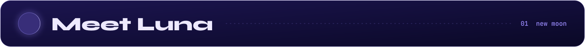

<table>
<tr>
<td width="42%" valign="top">
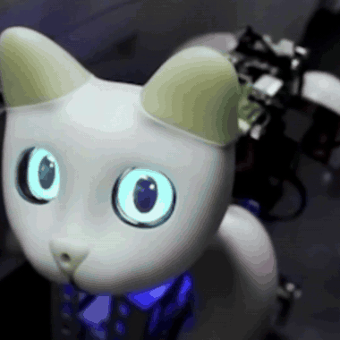
</td>
<td valign="top">

Luna is a robot cat that sits on your desk and watches the crypto market with you.

Charts are stressful to stare at. Luna turns them into something you can feel from across the room. Her eyes shift color with your watchlist, she purrs when a position hits take profit, chirps at breakouts, and stands up and hisses when something on your book gets close to liquidation.

She is not a trading bot with a cute skin. She is a companion. She remembers how you treat her, learns your habits, and gets a little anxious if you go quiet during a crash.

**What she does**

- Streams live prices from the exchanges you pick
- Maps market moves to mood, eyes, voice and pose
- Fires alerts you can snooze by patting her head
- Tracks portfolio PnL from read only keys or wallet addresses
- Recognizes your face and greets you with the overnight move
- Runs entirely on a Raspberry Pi inside her body

</td>
</tr>
</table>

<div align="center">

| Part of Luna | Status |
| :-- | :-- |
| Body, gait, 19 servo skeleton |  |
| Eye display, face recognition |  |
| SenseFur touch skin, PurrSynth voice |  |
| Personality engine and memory |  |
| Companion app |  |
| MarketSense price feeds and alerts |  |
| Mood bridge (market to personality) |  |
| Paper trading mode |  |

</div>

<br/>

<a id="how-she-reads-the-market"></a>
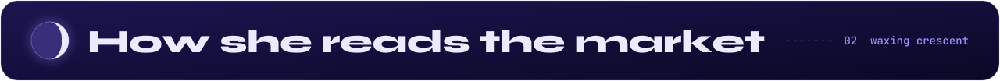

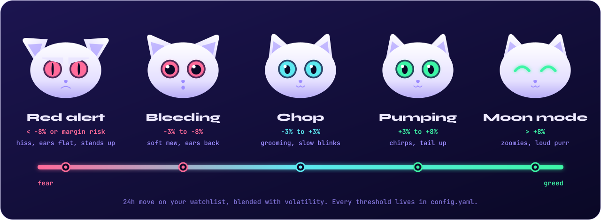

Luna does not just flash a color. Every market event is fed into the same personality engine that handles touch and faces, so a rough week actually changes her. After a long drawdown she gets clingy and cautious. After a clean run she gets bold and playful. Pet her during a dip and her mood recovers faster, just like yours.

<details>
<summary><b>Full reaction table</b></summary>
<br/>

| Market event | Eyes | Voice | Body |
| :-- | :-- | :-- | :-- |
| Price crosses a level you set | quick double blink | chirp | ears perk, head tilts toward you |
| Take profit filled | green, happy squint | long purr | kneads, slow blink |
| Stop loss hit | pink, pupils wide | soft mew | lies down, tail wraps |
| Position near liquidation | pink slits | hiss | stands up, arches back |
| Funding flips negative | cyan flicker | trill | tail twitch |
| Whale transfer on a watched wallet | cyan, wide | alert meow | looks at the door |
| Market flat for 6h | cyan, sleepy | none | grooms, then naps |
| You come back after a big move | color of the move | greeting | walks over with the summary |

</details>

<br/>

<a id="build-log"></a>
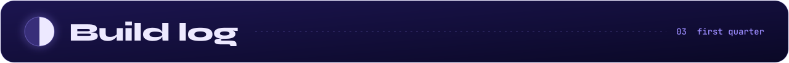

From a pile of servos on a test rig to a cat that blinks back at you.

<table>
<tr>
<td width="50%" align="center">
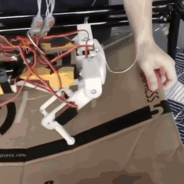
<br/><sub><b>Skeleton gait test.</b> First steps on the tether rig with the FlexBone-X legs and bare servo wiring.</sub>
<br/><sub><a href="assets/videos/01-skeleton-gait.mp4">watch full clip</a></sub>
</td>
<td width="50%" align="center">
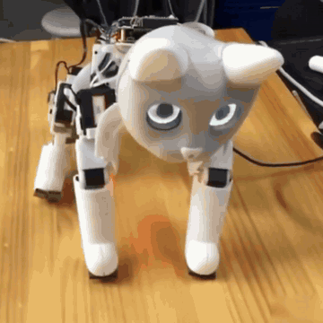
<br/><sub><b>Shell assembly.</b> Pi stack, driver boards and servos mounted, then the head and shell go on.</sub>
<br/><sub><a href="assets/videos/02-shell-assembly.mp4">watch full clip</a></sub>
</td>
</tr>
<tr>
<td width="50%" align="center">
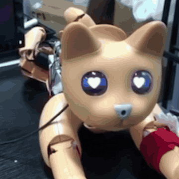
<br/><sub><b>Eye display.</b> Iris color, blink timing and pupil size tests. This is where the market colors live.</sub>
<br/><sub><a href="assets/videos/03-eye-display.mp4">watch full clip</a></sub>
</td>
<td width="50%" align="center">
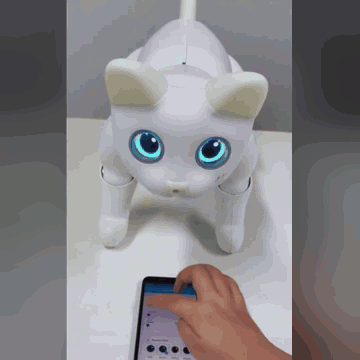
<br/><sub><b>Companion app.</b> Switching eye styles and poses from the phone. Price alerts land here next.</sub>
<br/><sub><a href="assets/videos/04-app-control.mp4">watch full clip</a></sub>
</td>
</tr>
</table>

<br/>

<a id="under-the-fur"></a>
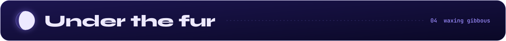

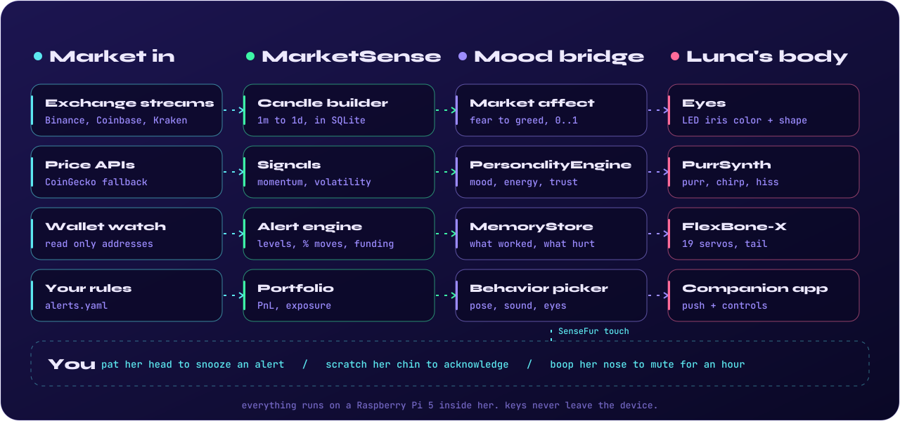

The whole runtime is a single Python process on the Pi. Subsystems run in their own threads and share one SQLite memory store. No message bus, no cloud, no account.

```
luna.runtime
  |
  +-- luna.market.MarketSense         exchange websockets, candles, alert engine   (new)
  +-- luna.market.MoodBridge          market affect into the personality engine    (new)
  +-- luna.firmware.NeuralUnit        UART, instinct model
  +-- luna.vision.VisionPipeline      face ID, depth, tracking
  +-- luna.tactile.SenseFurArray      128 point touch skin @ 100Hz
  +-- luna.personality.PersonalityEngine
  +-- luna.locomotion.LocomotionController
  +-- luna.audio.PurrSynth
  +-- luna.power.MoodCell
  +-- luna.memory.MemoryStore         SQLite, shared by everything
```

<details>
<summary><b>Hardware at a glance</b> (about $370 all in)</summary>
<br/>

| Part | Module | Job | Approx. |
| :-- | :-- | :-- | --: |
| Compute | Raspberry Pi 4B / 5 | runs everything, holds your keys | $55 |
| Neural unit | claude-neural-v3 | instinct and personality co-processor | $89 |
| Vision | ClaudeVision-Lite | face ID, tracking, depth | $34 |
| Skeleton | FlexBone-X | 19 DOF aluminum and TPU frame | $55 |
| Touch skin | SenseFur v2 | 128 point pressure and temperature | $22 |
| Voice | PurrSynth v2.1 | purrs, chirps, hisses | $14 |
| Battery | MoodCell 4400mAh | power, also feeds her energy level | $28 |
| Dock | RestPod v1 | wireless charging base | $17 |
| Tail | TailSense v2 | 3 DOF tail with tip sensor | $12 |
| Skin | silicone casing | shell and touch surface | $30 |
| Drivers | PCA9685 + MCP3008 | servo PWM and battery ADC | $12 |

Full wiring, pinouts, joint map, calibration and flashing guides live in **[docs/hardware.md](docs/hardware.md)**.

</details>

<br/>

<a id="quickstart"></a>
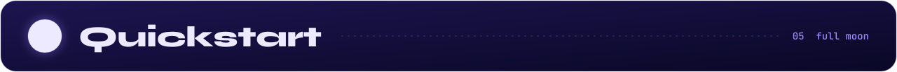

**1. Clone and install on the Pi** (64 bit Raspberry Pi OS Bookworm, Python 3.11+)

```bash
git clone https://github.com/nataliedevs/Ruby-Cat-Companion.git luna
cd luna
pip install -r requirements.txt
```

**2. Flash firmware and calibrate her skin**

```bash
./scripts/flash_neural.sh --port /dev/ttyUSB0 --verify
./scripts/flash_purrsynth.sh --port /dev/ttyUSB1
python3 scripts/calibrate_sensefur.py --output config/sensefur_cal.bin   # hands off for 5 seconds
```

**3. Let her learn your face**

```bash
python3 scripts/enroll_face.py --name "Natalie" --samples 30
```

**4. Give her a watchlist** in `config.yaml`

```yaml
market:
  exchanges: [binance, coinbase]        # public streams, no keys needed
  watchlist: [BTC, ETH, SOL]
  quote: USDT
  mood_window: 24h
  thresholds:                           # % move that sets each mood
    red_alert: -8
    bleeding: -3
    pumping: 3
    moon_mode: 8
  portfolio:
    keys_file: config/keys.enc          # read only keys, encrypted at rest
    wallets:
      - 0xYourWatchedAddress            # optional, read only
  quiet_hours: "00:00-07:00"            # she still watches, she just does not hiss
```

**5. Wake her up**

```bash
python3 -m luna.runtime --config config.yaml
```

<details>
<summary><b>Talk to her from Python</b> (preview API, may change)</summary>
<br/>

```python
from luna.market import MarketSense, Alert

ms = MarketSense.from_config("config.yaml")

ms.add_alert(Alert.level("BTC", above=100_000, react="chirp"))
ms.add_alert(Alert.move("SOL", pct=+5, window="1h", react="purr"))
ms.add_alert(Alert.liquidation(buffer_pct=10, react="hiss"))

@ms.on_mood
def mood_changed(state):
    # state.label  -> "chop" | "pumping" | "moon_mode" | "bleeding" | "red_alert"
    # state.affect -> 0.0 (fear) .. 1.0 (greed)
    print(state.label, round(state.affect, 2))

ms.start()
```

</details>

<br/>

<a id="roadmap"></a>
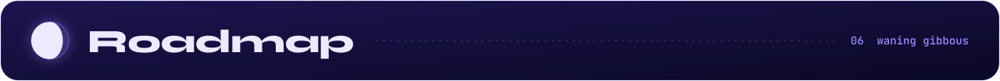

- [x] Walking skeleton and gait library
- [x] Eye display with blink, color and pupil control
- [x] Touch skin, voice, face recognition, persistent personality
- [x] Companion app prototype
- [ ] MarketSense: exchange websockets, candle store, alert engine
- [ ] Mood bridge: market affect wired into the personality engine
- [ ] Read only portfolio tracking (exchange keys and wallet addresses)
- [ ] Morning briefing when she sees your face
- [ ] Price alerts pushed to the companion app
- [ ] Paper trading mode where Luna calls the trades and you grade her
- [ ] On chain watch: whale moves, token unlocks, gas spikes

<br/>

<a id="keys-safety-fine-print"></a>
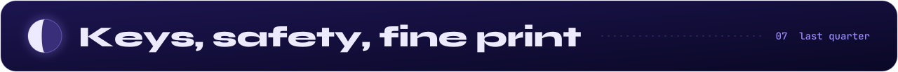

<table>
<tr>
<td width="33%" valign="top">

**Read only by default**

Luna only needs read permissions to watch prices and your portfolio. Create API keys with trading and withdrawals switched off. She has no reason to ever move your funds.

</td>
<td width="33%" valign="top">

**Keys stay home**

Keys are encrypted at rest on the Pi and never leave the device. No cloud, no telemetry, no account. Unplug the network and she still remembers you.

</td>
<td width="33%" valign="top">

**Not financial advice**

Luna is a companion, not an advisor. Her moods come from price action, not predictions. Crypto is volatile and you can lose money. Do your own research.

</td>
</tr>
</table>

<br/>

<details>
<summary><b>Contributing</b></summary>
<br/>

PRs are welcome. Commits follow `type(scope): description`, for example `feat(market): kraken websocket` or `fix(eyes): color fade timing`.

Before opening a PR:

```bash
ruff check luna/ tests/
mypy luna/ --ignore-missing-imports
pytest tests/unit/ -v
```

New gaits go in `config/gaits/`. New mood reactions go in `config/reactions.yaml`. Hardware changes need matching updates to `docs/hardware.md` and `bom.json`. Open an issue before starting anything big.

</details>

<br/>

<div align="center">

<sub><a href="#meet-luna">back to top</a></sub>
</div>
